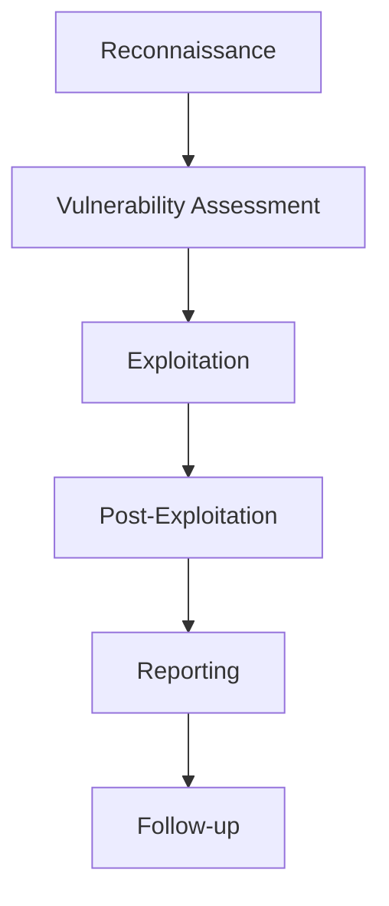

# Bastet Wisdom

Welcome to **Bastet Wisdom**, the comprehensive knowledge base for security testing and bug bounty hunting methodologies. This wiki is part of the Bastet.ai security tools suite, designed to help security researchers and bug bounty hunters systematically approach their targets.

## 🎯 What is Bastet Wisdom?

Bastet Wisdom is a curated collection of:

- **Methodologies**: Step-by-step approaches for different types of security assessments
- **Tools**: Documentation and usage guides for security testing tools
- **Checklists**: Comprehensive testing checklists to ensure nothing is missed
- **Payloads**: Ready-to-use payload collections for various attack scenarios
- **Best Practices**: Guidelines for professional security testing and reporting

## 🚀 Quick Start

### For New Bug Bounty Hunters

1. Start with our [Methodology Overview](methodology/overview.md)
2. Review the [Web Application Checklist](checklists/web-applications.md)
3. Familiarize yourself with [Reporting Best Practices](best-practices/reporting.md)

### For Experienced Researchers

1. Explore our specialized [Tool Documentation](tools/bastet-suite.md)
2. Master [DNS Enumeration](methodology/dns-enumeration.md) and [Nmap Scanning](methodology/nmap-scanning.md)
3. Access curated [Payload Collections](payloads/xss.md)
4. Review [Advanced Methodologies](methodology/reconnaissance.md)

## 📋 Testing Methodologies

Our testing approach follows a structured methodology:

## 🛠️ Bastet Suite Integration

This documentation is designed to work seamlessly with the Bastet.ai security tool suite:

- **Bastet Scanner**: Automated vulnerability discovery
- **Bastet Recon**: Intelligence gathering platform
- **Bastet Exploit**: Payload generation and testing
- **Bastet Report**: Automated reporting and documentation

## 🔒 Legal and Ethical Guidelines

!!! warning "Important"
    All methodologies and tools documented here are intended for:
    
    - Authorized security testing
    - Bug bounty programs with explicit permission
    - Educational and research purposes
    
    **Never** use these techniques against systems you don't own or lack explicit permission to test.

## 🤝 Contributing

This is a living document that evolves with the security community. Contributions are welcome through:

- [GitHub Issues](https://github.com/bastet-ai/bastet-wisdom/issues)
- [Pull Requests](https://github.com/bastet-ai/bastet-wisdom/pulls)
- Community feedback

## 📚 Navigation

Use the navigation menu to explore different sections:

- **Methodology**: Systematic approaches to security testing
- **Tools**: Software and scripts for various testing scenarios
- **Checklists**: Comprehensive testing guidelines
- **Payloads**: Attack vectors and exploitation techniques
- **Best Practices**: Professional standards and ethics

---

*Last updated: {{ git_revision_date_localized }}*