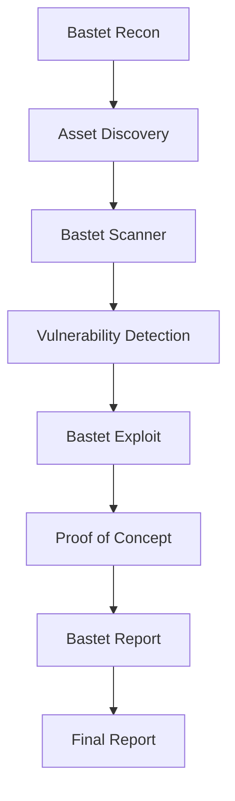

# Bastet Suite Tools

The Bastet Suite is a comprehensive collection of security testing tools designed specifically for bug bounty hunting and penetration testing. This page documents the core tools and their usage within the Bastet ecosystem.

## 🛠️ Core Tools Overview

### Bastet Scanner
**Automated Vulnerability Discovery Platform**

- **Purpose**: Comprehensive vulnerability scanning and assessment
- **Key Features**:
  - Multi-protocol scanning (HTTP/HTTPS, TCP, UDP)
  - Advanced web application testing
  - API security assessment
  - Custom payload injection
  - Real-time reporting

### Bastet Recon
**Intelligence Gathering and Reconnaissance**

- **Purpose**: Passive and active information gathering
- **Key Features**:
  - Subdomain enumeration
  - DNS analysis and zone transfers
  - Social media intelligence (SOCMINT)
  - Technology stack identification
  - Asset discovery and mapping

### Bastet Exploit
**Payload Generation and Testing Framework**

- **Purpose**: Custom exploit development and testing
- **Key Features**:
  - Automated payload generation
  - Multi-vector testing
  - Exploit chaining capabilities
  - Custom encoder/decoder modules
  - Integration with external frameworks

### Bastet Report
**Automated Documentation and Reporting**

- **Purpose**: Professional security assessment reporting
- **Key Features**:
  - Template-driven report generation
  - Evidence management
  - Risk scoring and prioritization
  - Executive summary generation
  - Multi-format export (PDF, HTML, JSON)

## 🚀 Quick Start Guide

### Installation

```bash
# Clone the Bastet Suite repository
git clone https://github.com/bastet-ai/bastet-suite.git
cd bastet-suite

# Install dependencies
pip install -r requirements.txt

# Initialize the environment
./bastet init
```

### Basic Usage

```bash
# Run a comprehensive scan
bastet scan --target example.com --full

# Perform reconnaissance
bastet recon --domain example.com --passive

# Generate custom payloads
bastet exploit --type xss --target "https://example.com/search?q="

# Create a report
bastet report --scan-id 12345 --template detailed
```

## 📋 Tool Integration Workflow



## 🔧 Configuration

### Global Configuration

Location: `~/.bastet/config.yml`

```yaml
# Global Bastet Configuration
api:
  endpoint: "https://api.bastet.ai"
  key: "your-api-key-here"

scanning:
  default_threads: 10
  timeout: 30
  user_agent: "Bastet-Suite/1.0"

reporting:
  default_template: "standard"
  output_directory: "./reports"
  include_screenshots: true

proxy:
  enabled: false
  host: "127.0.0.1"
  port: 8080
```

### Per-Project Configuration

```yaml
# Project-specific configuration
project:
  name: "Example Corp Assessment"
  scope:
    - "*.example.com"
    - "example.org"
  exclusions:
    - "admin.example.com"
    - "internal.example.com"

targets:
  web_applications:
    - "https://example.com"
    - "https://app.example.com"
  apis:
    - "https://api.example.com/v1"
    - "https://api.example.com/v2"
```

## 📚 Advanced Usage

### Custom Modules

Extend Bastet functionality with custom modules:

```python
# custom_scanner.py
from bastet.core import BaseModule

class CustomScanner(BaseModule):
    def __init__(self):
        super().__init__()
        self.name = "Custom Business Logic Scanner"
    
    def run(self, target):
        # Custom scanning logic here
        pass
```

### API Integration

```python
# Using Bastet programmatically
from bastet import BastetClient

client = BastetClient(api_key="your-key")
scan = client.create_scan(target="example.com")
results = client.get_results(scan.id)
```

## 🔍 Tool-Specific Documentation

- [Scanner Configuration](../checklists/web-applications.md)
- [Recon Techniques](../methodology/reconnaissance.md)
- [Exploit Development](../methodology/exploitation.md)
- [Report Templates](../best-practices/reporting.md)

## 🐛 Troubleshooting

### Common Issues

**Connection Timeouts**
```bash
# Increase timeout values
bastet config set scanning.timeout 60
```

**Rate Limiting**
```bash
# Reduce thread count
bastet config set scanning.threads 5
```

**Authentication Errors**
```bash
# Verify API key
bastet auth verify
```

## 📖 Further Reading

- [Bastet Suite GitHub Repository](https://github.com/bastet-ai/bastet-suite)
- [API Documentation](https://docs.bastet.ai/api)
- [Community Forum](https://community.bastet.ai)

---

*For support and feature requests, visit our [GitHub Issues](https://github.com/bastet-ai/bastet-suite/issues) page.*
